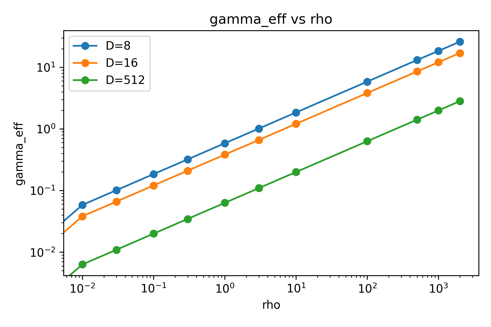
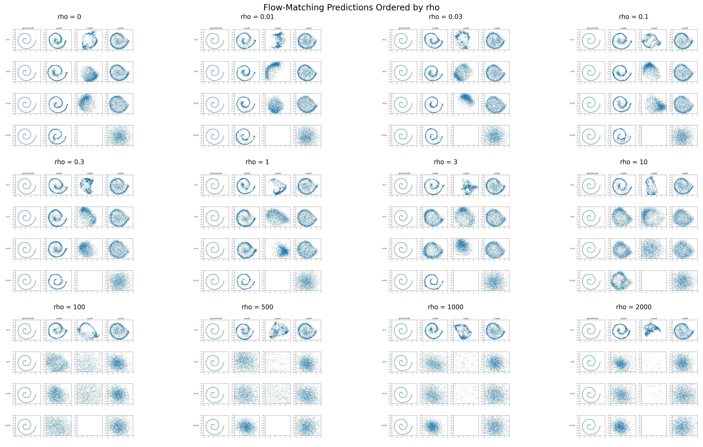

# Manifold Learning: Flow-Matching Toy Reproduction from paper "Back to Basics: Let Denoising Generative Models Denoise"

This repo reproduces toy manifold-learning results using flow matching, with additional exploration in high dimensions:

- toy 2D reproduction
- toy high-dimensional exploration

<details>
<summary>Toy 2D reproduction</summary>

## Files

- `toyD2_base/train_base.py`: main code (data, training, sampling, plotting, GIF)
- `toyD2_base/run.sh`: one-process full pipeline (all figures + GIF)
- `toyD2_base/run_gif.sh`: GIF-only script (separate simple entrypoint)

## Requirements

Python 3.9+ recommended.

Install dependencies:

```bash
pip install numpy torch matplotlib scikit-learn pillow
```

Notes:
- GPU is optional. Code falls back to CPU.
- `matplotlib` uses `Agg` backend (headless, no GUI required).

## Quick Start

Run full pipeline:

```bash
bash toyD2_base/run.sh
```

Run GIF-only script:

```bash
bash toyD2_base/run_gif.sh
```

## Outputs

Running `toyD2_base/run.sh` produces:

`toyD2_base/fig_generation_pca.png`: PCA-based visualization of ground truth, buried data, noise, and mixed `z_t` states for each `D`.
<a href="./toyD2_base/fig_generation_pca.png"></a>

`toyD2_base/fig_generation_projection_matrix.png`: Generation results projected back to 2D with the known projection matrix, comparing model parameterizations.
<a href="./toyD2_base/fig_generation_projection_matrix.png"></a>

`toyD2_base/fig_flow_matching.png`: Main flow-matching comparison figure across dimensions and parameterizations.
<a href="./toyD2_base/fig_flow_matching.png"></a>

GIF previews (`D=16`, `x` / `eps` / `v`):

<p align="center">
  <a href="./toyD2_base/flow_D16_x.gif"></a>
  <a href="./toyD2_base/flow_D16_eps.gif"></a>
  <a href="./toyD2_base/flow_D16_v.gif"></a>
</p>

Generate `eps` GIF if missing:

```bash
cd toyD2_base
bash run_gif.sh
```


## Main Config Knobs

In `toyD2_base/train_base.py` inside `run_all_results_single_process(...)`:

- `n_points`: single sample-count knob (data + sampling + GIF points)
- `train_steps_map`: training steps per `D`
- `batch_size`, `lr`
- `sample_steps`: ODE integration steps for static generation figure
- `gif_sample_steps`: ODE steps for GIF (`None` means use `sample_steps`)
- `gif_D`, `gif_param`: choose which trained panel to animate
- `gif_frame_stride`: save one GIF frame every N solver steps
- `gif_hold_last_seconds`: keep final frame static at `t=1`

## Reproducibility

- Seed is fixed in code (`SEED = 0`) for NumPy and PyTorch.
- Static figure and GIF can share the same initial noise for the chosen panel, so final frame matches static result better.

</details>


<details>
<summary>toy high dimension exploration</summary>

## High-Dimensional Setting

To study when the advantage of **x-prediction** breaks down, we extend the spiral toy experiment to a **high-dimensional setting**.

### 1. Embedding the spiral into a high-dimensional space

We start from spiral samples

<p align="center">

</p>

and embed them into a \(D\)-dimensional space using a random column-orthonormal projection matrix

<p align="center">

</p>

The buried spiral data becomes

<p align="center">

</p>

which lies entirely in the **2-dimensional subspace** spanned by \(P\).

---

### 2. Adding orthogonal high-dimensional signal

To gradually increase the intrinsic dimensionality of the dataset, we add signal in the orthogonal complement of this subspace.

We first sample Gaussian noise

<p align="center">

</p>

and remove its component inside the spiral subspace

<p align="center">

</p>

The final data point is constructed as

<p align="center">

</p>

The scaling factor \( \gamma \) controls the strength of the orthogonal high-dimensional signal.

---

### 3. Energy-controlled signal strength

Instead of selecting \( \gamma \) directly, we control the signal using an **energy ratio**

<p align="center">

</p>

Solving for \( \gamma \) gives

<p align="center">

</p>

This formulation ensures that the **relative signal strength is controlled by \( \rho \)** rather than by the ambient dimension \(D\).

---

### Interpretation of ρ

- **ρ ≈ 0** → the data remains close to a **low-dimensional manifold**
- **ρ ≈ 1** → orthogonal signal has comparable energy to the spiral
- **large ρ** → the dataset becomes **intrinsically high-dimensional**

This controlled interpolation allows us to study how the behavior of different parameterizations (`x`, `ε`, `v`) changes as the data transitions from a **low-dimensional manifold regime** to a **high-dimensional signal regime**, especially when the model is **under-complete** (e.g. a 256-dimensional MLP operating in \(D=512\)).

---

### Relation between ρ and γ

The calibration plot below follows directly from the energy definition.

Since

<p align="center">

</p>

we obtain

<p align="center">

</p>

Let

<p align="center">

</p>

Then

<p align="center">

</p>

Taking logarithms gives

<p align="center">

</p>


Therefore, on a **log–log plot**, the relationship between \( \log\gamma \) and \( \log\rho \) is **linear with slope \(1/2\)**.

---

<p align="center">

</p>

<p align="center">
Calibration curve showing the relation between the orthogonal signal scale \( \gamma \) and the energy ratio \( \rho \).
</p>

---

### Effect on the intrinsic dimensionality

When **ρ is small**, most of the dataset energy remains inside the **2-dimensional spiral subspace**, so the effective dimensionality stays low even when the ambient dimension \(D\) is large.

As **ρ increases**, the orthogonal component introduces signal across many directions in the \(D-2\) dimensional space, increasing the **intrinsic dimension** of the data.

Consequently, the prediction task becomes significantly harder for an **under-complete model**, since the model must represent meaningful structure across many more directions of the ambient space.

---

<p align="center">

</p>

---

### Exploring the joint effect of ρ and D

The behavior in the high-dimensional experiment is governed by **two variables**:

- the ambient dimension `D`
- the orthogonal signal strength `ρ`

Empirically, some values of `ρ` work well at both low and high dimensions, but fail at intermediate dimensions. This suggests that performance is not a function of `ρ` alone, but of the joint interaction

<p align="center">

</p>

A useful interpretation is to view the construction as a **low-rank signal plus orthogonal bulk** model:

- the buried spiral provides a structured 2D signal subspace
- the orthogonal component spreads energy across `D − 2` directions

At fixed total orthogonal energy `ρ`, increasing `D` spreads that energy over more orthogonal directions. This motivates testing the derived scaling variable

<p align="center">

</p>

which measures the approximate orthogonal energy **per direction**.

To analyze this interaction, we log a distribution-level metric for each `(D, ρ, param)` pair and visualize:

1. **Phase diagram**: performance heatmap over `(D, ρ)`
2. **Error vs D** for fixed `ρ`
3. **Error vs ρ / (D − 2)** to test whether curves collapse across dimensions

As a first metric, we use a 2D **MMD** (maximum mean discrepancy) between the generated samples projected back to 2D and the ground-truth spiral. If plotting against `ρ / (D − 2)` aligns the curves better than plotting against `ρ`, this suggests that the relevant control variable is not total orthogonal energy alone, but orthogonal energy per dimension.


## Files

- `toy_highdim/trainv3.py` — high-dimensional flow-matching experiments with ρ sweep and statistics logging  
- `toy_highdim/runv3.sh` — one-command run script for the sweep  
- `toy_highdim/outputs/` — generated figures and statistics  
- `toy_highdim/plot2.py` — additional plotting utilities

---

## Quick Start

Run the high-dimensional sweep:

```bash
cd toy_highdim
bash runv3.sh
</details>
