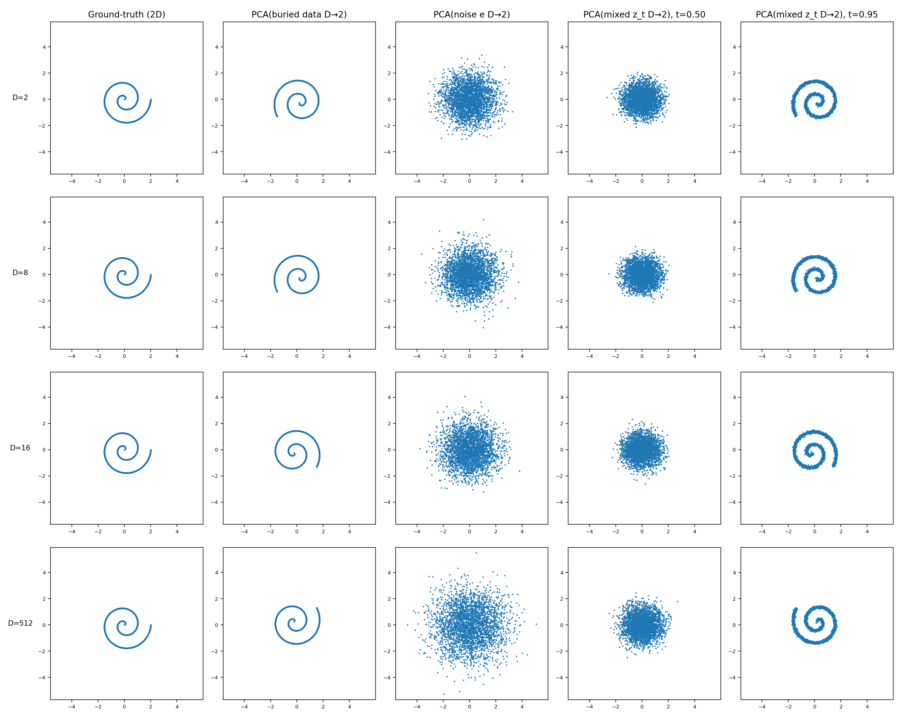
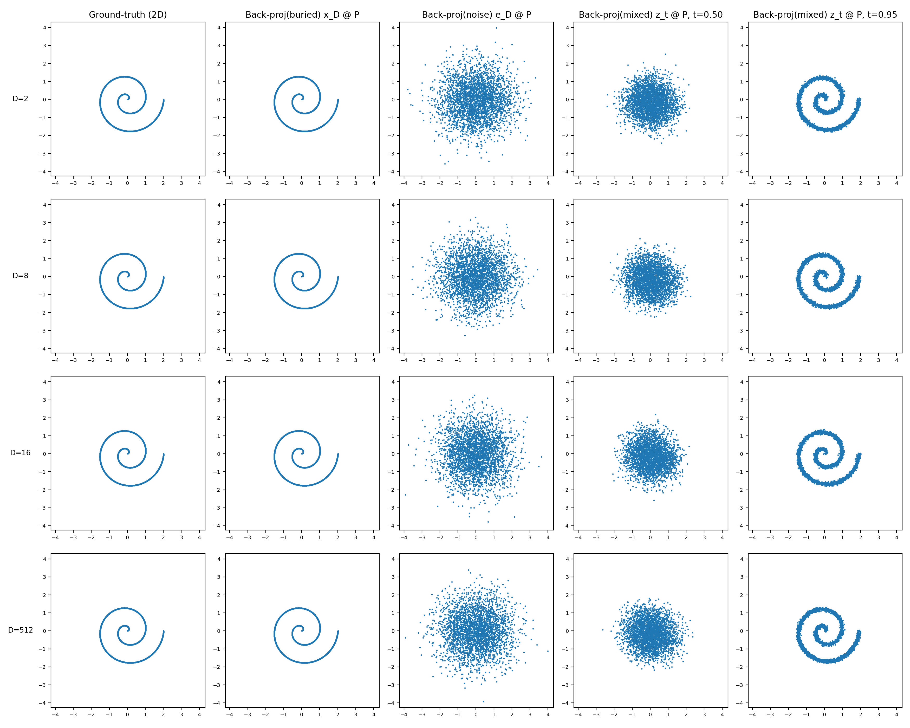
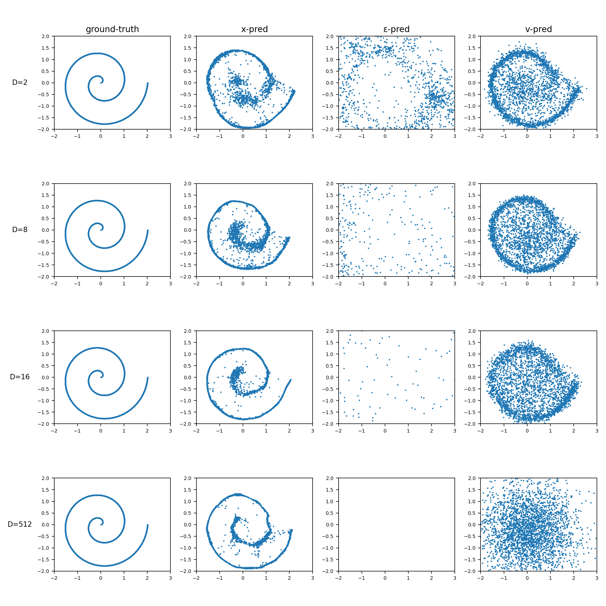
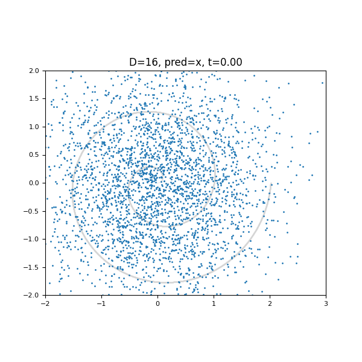
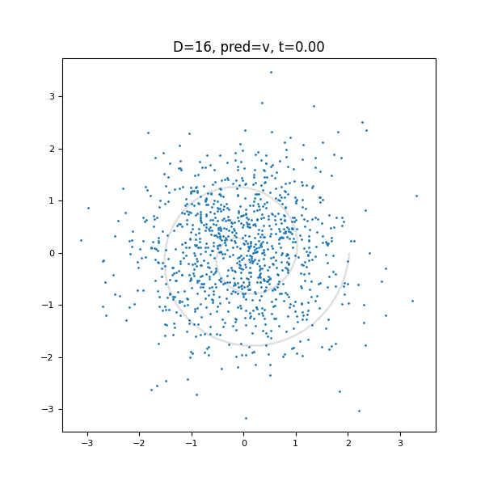
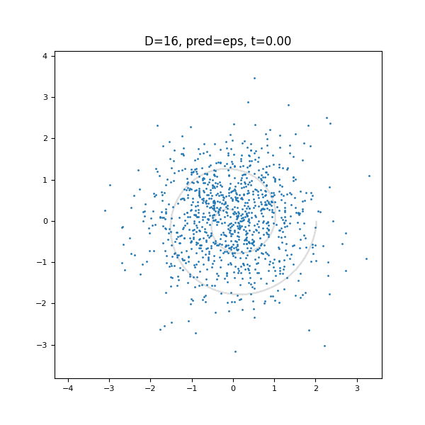

# Manifold Learning: Flow-Matching Toy Reproduction from paper "Back to Basics: Let Denoising Generative Models Denoise"

This repo reproduces toy manifold-learning results using flow matching, with additional exploration in high dimensions:

- toy 2D reproduction
- toy high-dimensional exploration

<details>
<summary>Toy 2D reproduction</summary>

## Files

- `toyD2_base/train_base.py`: main code (data, training, sampling, plotting, GIF)
- `toyD2_base/run.sh`: one-process full pipeline (all figures + GIF)
- `toyD2_base/run_gif.sh`: GIF-only script (separate simple entrypoint)

## Requirements

Python 3.9+ recommended.

Install dependencies:

```bash
pip install numpy torch matplotlib scikit-learn pillow
```

Notes:
- GPU is optional. Code falls back to CPU.
- `matplotlib` uses `Agg` backend (headless, no GUI required).

## Quick Start

Run full pipeline:

```bash
bash toyD2_base/run.sh
```

Run GIF-only script:

```bash
bash toyD2_base/run_gif.sh
```

## Outputs

Running `toyD2_base/run.sh` produces:

`toyD2_base/fig_generation_pca.png`: PCA-based visualization of ground truth, buried data, noise, and mixed `z_t` states for each `D`.
<a href="./toyD2_base/fig_generation_pca.png"></a>

`toyD2_base/fig_generation_projection_matrix.png`: Generation results projected back to 2D with the known projection matrix, comparing model parameterizations.
<a href="./toyD2_base/fig_generation_projection_matrix.png"></a>

`toyD2_base/fig_flow_matching.png`: Main flow-matching comparison figure across dimensions and parameterizations.
<a href="./toyD2_base/fig_flow_matching.png"></a>

`toyD2_base/flow_D16_x.gif`: Time-evolution animation from Gaussian noise to the spiral for `D=16`, `x-pred`.
<a href="./toyD2_base/flow_D16_x.gif"></a>

`toyD2_base/flow_D16_v.gif`: Time-evolution animation from Gaussian noise to the spiral for `D=16`, `v-pred`.
<a href="./toyD2_base/flow_D16_v.gif"></a>


`toyD2_base/flow_D16_eps.gif`: Time-evolution animation from Gaussian noise to the spiral for `D=16`, `eps-pred`.
<a href="./toyD2_base/flow_D16_eps.gif"></a>


## Main Config Knobs

In `toyD2_base/train_base.py` inside `run_all_results_single_process(...)`:

- `n_points`: single sample-count knob (data + sampling + GIF points)
- `train_steps_map`: training steps per `D`
- `batch_size`, `lr`
- `sample_steps`: ODE integration steps for static generation figure
- `gif_sample_steps`: ODE steps for GIF (`None` means use `sample_steps`)
- `gif_D`, `gif_param`: choose which trained panel to animate
- `gif_frame_stride`: save one GIF frame every N solver steps
- `gif_hold_last_seconds`: keep final frame static at `t=1`

## Reproducibility

- Seed is fixed in code (`SEED = 0`) for NumPy and PyTorch.
- Static figure and GIF can share the same initial noise for the chosen panel, so final frame matches static result better.

</details>


<details>
<summary>toy high dimension exploration</summary>

## High-Dimensional Setting

### High-Dimensional Setting

To study when the advantage of **x-prediction** breaks down, we extend the toy spiral experiment to a high-dimensional setting.

#### 1. Embedding the spiral into a high-dimensional space

We start with spiral samples  


and embed them into a \(D\)-dimensional space using a random column-orthonormal projection matrix

<p align="center">

</p>

The buried spiral data becomes

<p align="center">

</p>

which lies entirely in the 2-dimensional subspace spanned by \(P\).

---

#### 2. Adding orthogonal high-dimensional signal

We sample Gaussian noise

<p align="center">

</p>

and remove its component in the spiral subspace

<p align="center">

</p>

The final data point is constructed as

<p align="center">

</p>

---

#### 3. Energy-controlled signal strength

Instead of choosing the scale factor \( \gamma \) directly, we control the signal strength with an **energy ratio**

<p align="center">

</p>

Solving for \( \gamma \) gives

<p align="center">

</p>

---

#### Interpretation

- **ρ ≈ 0** → the data remains close to a **low-dimensional manifold**
- **ρ ≈ 1** → orthogonal signal has comparable energy to the spiral
- **large ρ** → the dataset becomes **intrinsically high-dimensional**

This controlled interpolation allows us to study how the behavior of different parameterizations (`x`, `ε`, `v`) changes as the data transitions from a **low-dimensional manifold regime** to a **truly high-dimensional signal regime**, especially when the model is **under-complete** (for example a 256-dimensional MLP operating in \(D = 512\)).


## Files

- `toy_highdim/trainv3.py`: high-dimensional flow-matching experiments with `rho` sweep and summary stats
- `toy_highdim/runv3.sh`: one-command run script for the high-dimensional sweep
- `toy_highdim/outputs/`: generated figures and stats
- `toy_highdim/plot2.py`: extra plotting utility for gamma-scaling analysis

## Quick Start

Run the high-dimensional sweep:

```bash
cd toy_highdim
bash runv3.sh
```

## Outputs

Running `toy_highdim/runv3.sh` writes results to `toy_highdim/outputs/`:

- `rho*_fig_generation_pca.png`: PCA projections of generated samples for each `rho`
- `rho*_fig_generation_projection_matrix.png`: projection-matrix 2D views for each `rho`
- `rho*_fig_flow_matching.png`: flow-matching comparison figure for each `rho`
- `all_signal_stats.csv` and `all_signal_stats.txt`: per-run signal statistics (`rho`, `gamma_eff`, energy ratios, effective rank)
- `rho_vs_gamma.png`: summary curve of effective gamma versus `rho`

Default `rho` sweep in `trainv3.py`:

`[0.0, 0.01, 0.03, 0.1, 0.3, 1.0, 3.0, 10.0, 100, 500, 1000, 2000]`

## Main Config Knobs

In `toy_highdim/trainv3.py` inside `run_all_results_single_process(...)`:

- `Ds`: dimensions to evaluate (default run uses `(2, 8, 16, 512)`)
- `n_points`: dataset and sampling size
- `train_steps_map`: training steps per dimension
- `batch_size`, `lr`, `noise_scale`
- `sample_steps`: ODE integration steps for generation
- `rho` (or `gamma` alias): high-dimensional orthogonal signal strength
- `gamma_seed`: seed for the added high-dimensional signal
- `out_dir`: output directory (default `outputs`)


</details>
